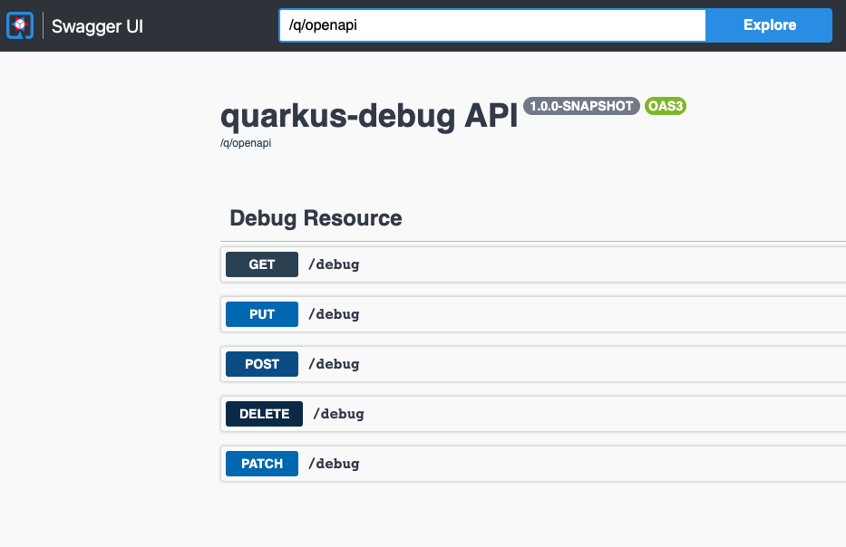

# Quarkus Debug Project

## Purpose

This is a simple project to help anyone debug http requests. When using a proxy/gateway or any kind of API Management solution, it may help you when you cannot call external APIs (https://echo-api.3scale.net:443 or http://postman-echo.com/get for example) and want to check how your payload is reaching the backend.

## How to install

### Docker Image

TBD

### Build on OpenShift

```bash
oc new-project debug
oc new-app registry.access.redhat.com/redhat-openjdk-18/openjdk18-openshift~https://github.com/luszczynski/quarkus-debug.git --name=debug -n debug
oc expose svc/debug --path=/debug -n debug
```

### Locally

```bash
quarkus dev
```

## Running

```bash
# Using httpie
http http://127.0.0.1:8080/debug

HTTP/1.1 200 OK
Cache-control: private
Content-Length: 174
Content-Type: application/json
Set-Cookie: 0583d7385ac1fa0c0483f966682199e4=be6881f09275d76e9ef371c961254aab; path=/; HttpOnly

{
    "body": "",
    "cookieMap": {},
    "count": 5,
    "headers": {
        "empty": false
    },
    "method": "GET",
    "path": "/debug",
    "pathParams": {},
    "queryParams": {},
    "remoteAddress": "10.1.6.1:41328",
    "uri": "/debug"
}

# Using curl
curl http://127.0.0.1:8080/debug

Debug [absoluteURI=http://127.0.0.1:8080/debug, args=null, body=null, cookieMap={}, cookiesCount=0, count=0, headers=Host=127.0.0.1:8080
User-Agent=curl/7.79.1
Accept=*/*
, headersCount=3, host=127.0.0.1:8080, largeJson=null, method=GET, path=/debug, pathParams={}, queryParams={}, rawMethod=null, remoteAddress=127.0.0.1:51898, ssl=false, uri=/debug]
```

Swagger UI

http://127.0.0.1:8080/q/swagger-ui




### Fixed Delay

Injecting delay of 100ms

```bash
http http://127.0.0.1:8080/debug?fixedDelay=100
```

### Random Delay

Inject a random delay between `randomDelayBegin` and `randomDelayEnd`.
The following example will choose randomly a number between 1000ms and 5000ms and apply the delay

```bash
http http://127.0.0.1:8080/debug?randomDelayBegin=1000&randomDelayEnd=5000
```

### Returned Status Code

Choose the returned status code

```bash
http http://127.0.0.1:8080/debug?statusCode=201
```

### Return a large JSON

```bash
http http://127.0.0.1:8080/debug?processLargeJson=true
```

### Delay and Status Code

```bash
http http://127.0.0.1:8080/debug?delay=100&statusCode=500
```

### Hang Indefinitely

```bash
http http://127.0.0.1:8080/debug?hangIndefinitely=true
```
